# 1주차: 개발 환경 구축 보고서

---

## 1. 프로젝트 개요

본 과제의 목표는 개발 환경을 직접 구축하고,
터미널, Git, Docker를 활용하여 재현 가능한 실행 환경을 만드는 것이다.

---

## 2. 실습 환경

* **OS**: Windows 11
* **Shell**: Git Bash
* **Docker**: 29.2.0
* **Git**: 2.53.0
* **작성일**: 2026-03-31

---

## 3. Phase 1: 터미널 기초 + 권한 실습

### 3-1. Git 설정 확인

```bash
git config --list
```

설명: 사용자 정보(user.name, user.email)가 정상 등록된 것을 확인했다.

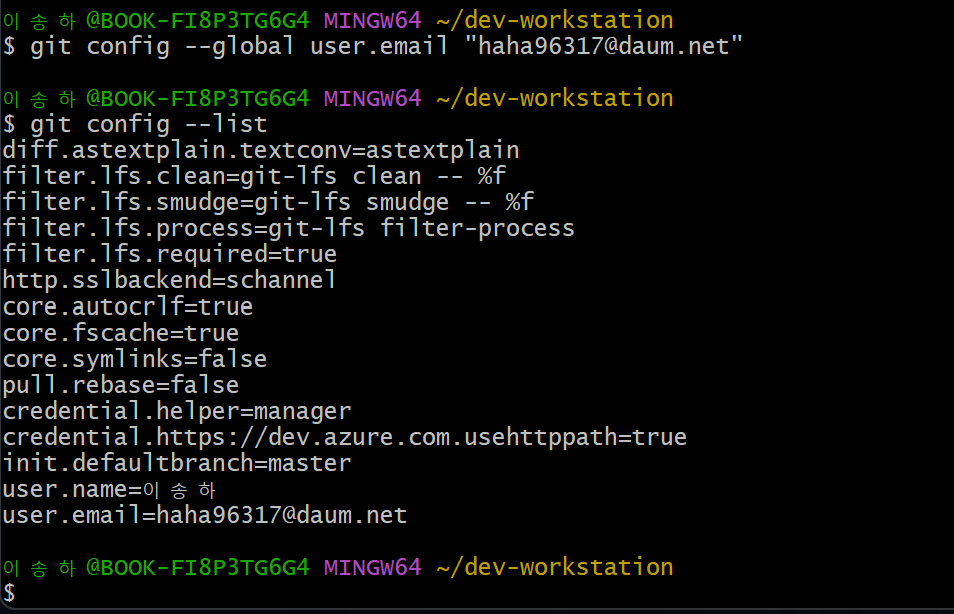

---

### 3-2. 현재 위치 확인

```bash
pwd
```

설명: 현재 작업 디렉토리 위치를 확인하였다.

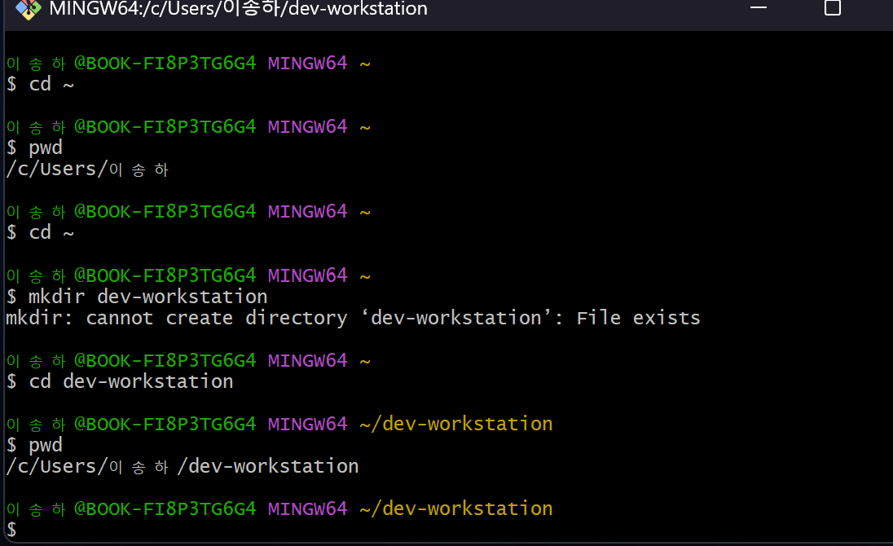

---

### 3-3. 파일 및 폴더 생성

```bash
mkdir app docs
touch README.md test.txt
ls -la
```

설명: 폴더와 파일을 생성하고 숨김 파일 포함 목록을 확인하였다.

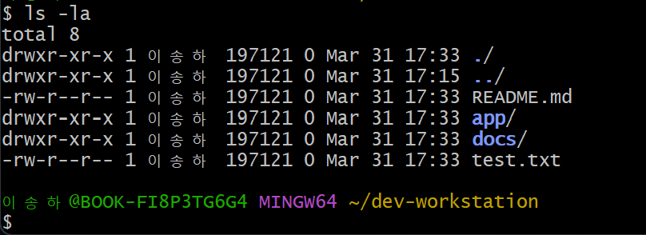

---

### 3-4. 파일 복사 및 이름 변경

```bash
cp test.txt copy.txt
mv copy.txt renamed.txt
```

설명: 파일을 복사하고 이름을 변경하였다.

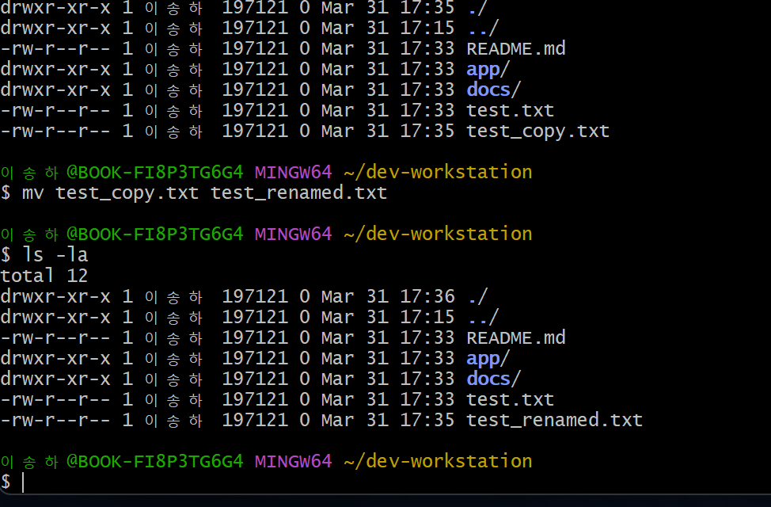

---

### 3-5. 파일 삭제

```bash
rm renamed.txt
```

설명: 파일 삭제 후 목록에서 사라진 것을 확인하였다.

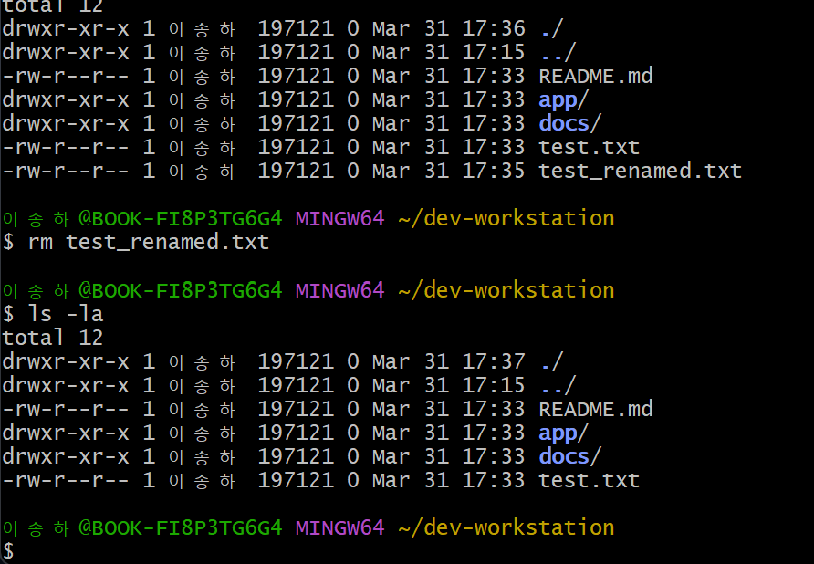

---

### 3-6. 권한 변경

```bash
chmod 644 test.txt
chmod 755 app
ls -la
```

설명: 파일과 폴더 권한을 변경하고 결과를 확인하였다.

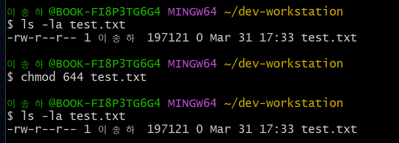

---

### 3-7. 폴더 구조 확인

```bash
ls
```

설명: 전체 프로젝트 구조를 확인하였다.

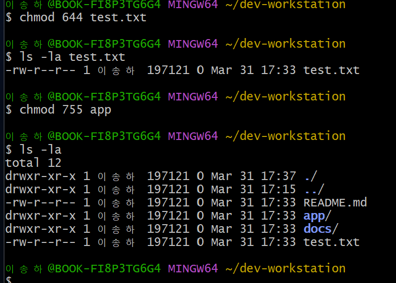

---

### 3-8. Git 초기화 및 연결

```bash
git init
git remote add origin <repository-url>
```

설명: Git 저장소를 초기화하고 GitHub와 연결하였다.

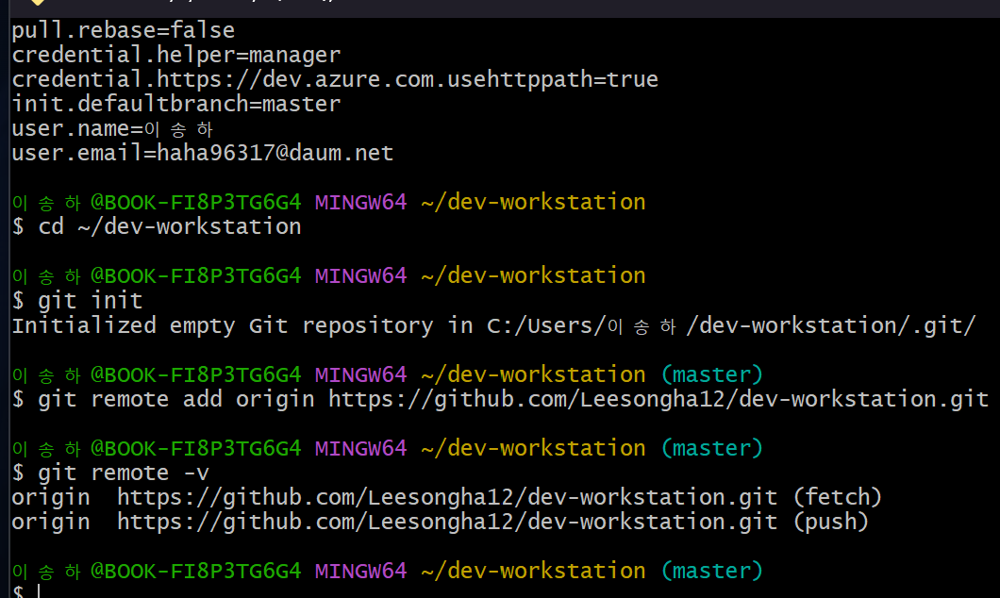

---

## 4. 권한 숫자 해석

|     표기    |  숫자 | 권한 설명                    |
| :-------: | :-: | :----------------------- |
| rw-r--r-- | 644 | 소유자(읽기/쓰기), 그룹/기타(읽기만)   |
| rwxr-xr-x | 755 | 소유자(모든 권한), 그룹/기타(읽기/실행) |

---

## 5. Git 파일 추적 상태 확인

### 문제 상황

```bash
git status
```

출력:

```bash
Untracked files:
  images/project-structure.png
```

### 원인

* 새로 생성한 파일은 Git이 자동으로 추적하지 않는다.

### 해결 방법

```bash
git add images/project-structure.png
git commit -m "Add: project structure screenshot"
git push origin main
```

### 설명

* `git add`: 파일을 추적 대상으로 등록
* `git commit`: 변경사항 저장
* `git push`: 원격 저장소에 업로드

### 실행 결과

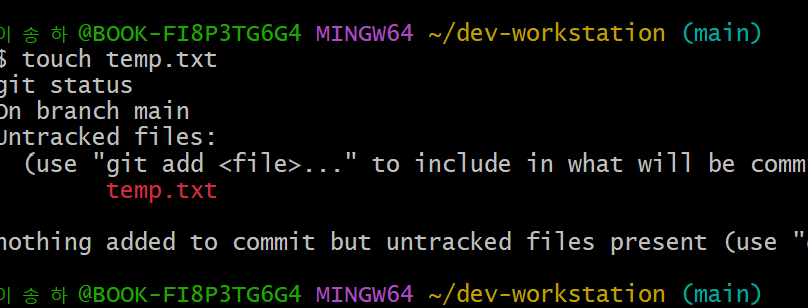

---

## 6. Phase 4: Docker hello-world 실행

### 실행 명령

```bash
docker run hello-world
```

### 출력 결과

```bash
Hello from Docker!
This message shows that your installation appears to be working correctly.
```

### 설명

* Docker Hub에서 이미지를 다운로드하여 실행하였다.
* Docker 엔진이 정상적으로 동작함을 확인하였다.

### 동작 과정 이해

1. Docker client → daemon 요청
2. daemon → Docker Hub 이미지 다운로드
3. 컨테이너 생성 및 실행
4. 결과 출력

### 실행 결과

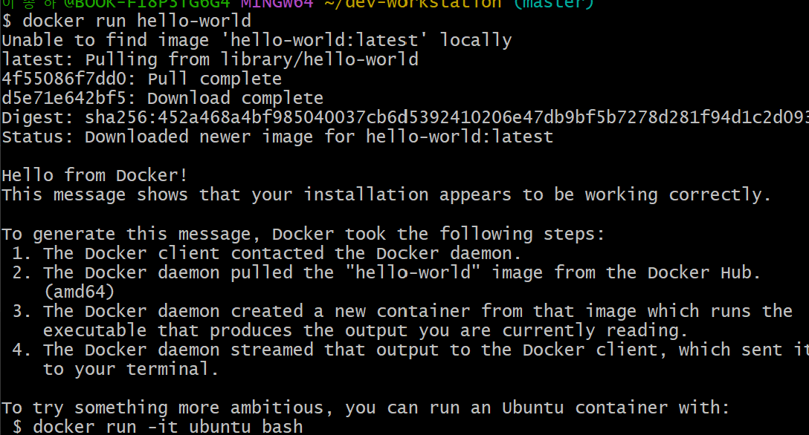

---

## 7. 프로젝트 구조

설명: 최종 작업 디렉토리 구조

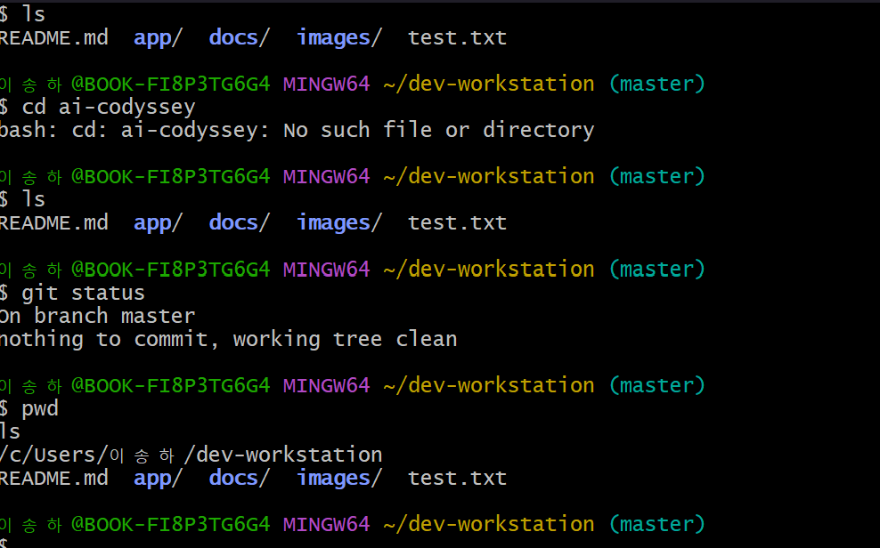

---

## 8. ubuntu 컨테이너 실행 및 내부 진입

### 실행 명령

```bash
docker run -it --name ubuntu-test ubuntu bash
```

### 내부 명령 실행

```bash
ls
echo "hello ubuntu"
pwd
```

### 종료 후 상태 확인

```bash
exit
docker ps -a
```

### 설명

* ubuntu 이미지를 다운로드하고 컨테이너를 실행하였다.
* 컨테이너 내부에서 `ls`, `echo`, `pwd` 명령을 실행하였다.
* `exit` 후 `docker ps -a`를 통해 컨테이너 상태가 Exited로 변경된 것을 확인하였다.
* 전체 실행 과정을 하나의 흐름으로 확인하였다.

### 실행 결과

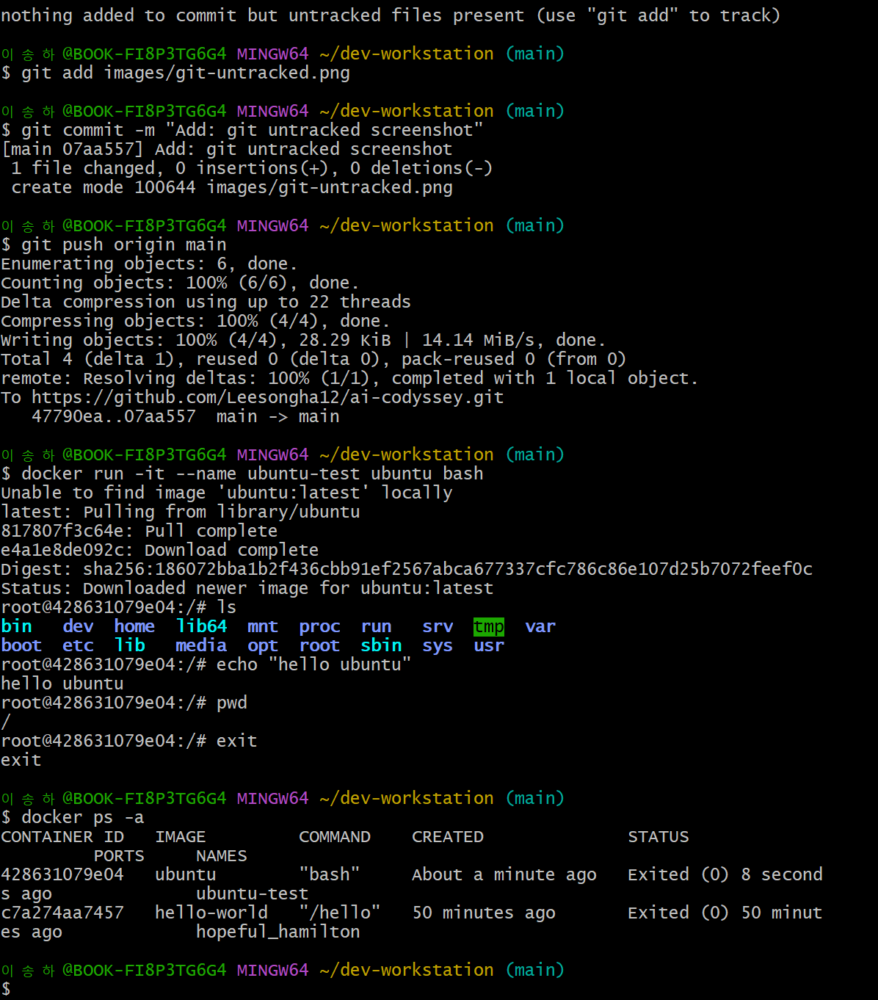

---

### attach와 exec 차이

* `attach`: 실행 중인 컨테이너의 표준 입출력에 연결


---

## 9. Dockerfile 기반 커스텀 웹 서버 이미지 제작

### 베이스 이미지 선택
- `nginx:alpine` 이미지를 베이스로 선택하였다.
- 정적 HTML 파일만 교체하는 방식으로 커스텀 이미지를 제작하였다.

---

### Dockerfile
```dockerfile
FROM nginx:alpine

LABEL org.opencontainers.image.title="codyssey-web"
ENV APP_ENV=dev

COPY app/index.html /usr/share/nginx/html/index.html
```

---

### 웹 서버 소스 코드
```html
<!DOCTYPE html>
<html lang="ko">
<head>
  <meta charset="UTF-8">
  <title>Codyssey Week 1</title>
</head>
<body>
  <h1>안녕하세요, Codyssey 1주차 과제입니다.</h1>
  <p>Dockerfile 기반 커스텀 이미지 실행 성공</p>
</body>
</html>
```

---

### 빌드 및 실행 명령
```bash
docker build -t codyssey-web:1.0 .
docker run -d -p 8080:80 --name codyssey-web-container codyssey-web:1.0
docker ps
docker logs codyssey-web-container
```

---

### 설명
- NGINX 웹 서버 이미지를 기반으로 커스텀 이미지를 생성하였다.
- `COPY` 명령어를 통해 HTML 파일을 컨테이너 내부로 복사하였다.
- `-p 8080:80` 옵션으로 로컬 포트와 컨테이너 포트를 연결하였다.
- 브라우저 접속을 통해 웹 서버 정상 실행을 확인하였다.

---

### 실행 결과

#### 1) 이미지 빌드 성공
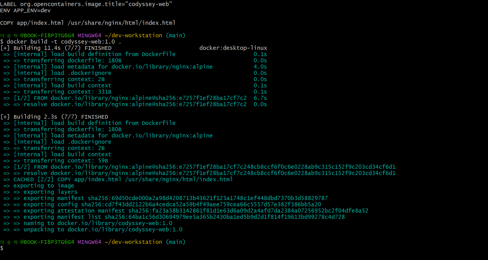

#### 2) 컨테이너 실행 및 포트 매핑 확인
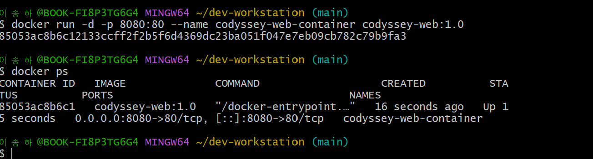

#### 3) 컨테이너 로그 확인
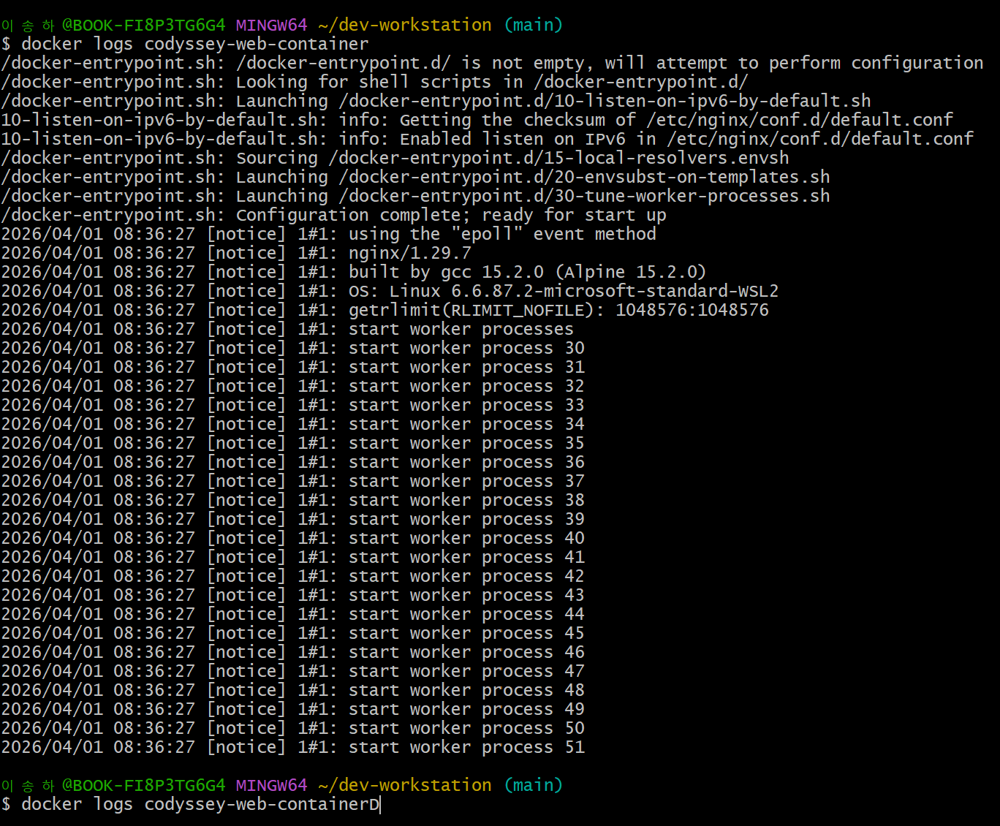

#### 4) 브라우저 접속 결과
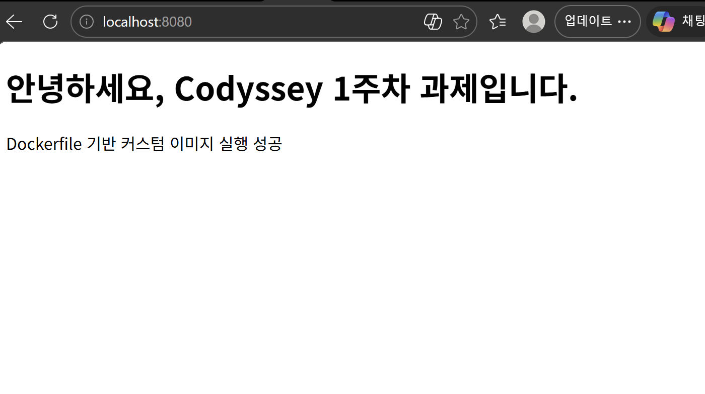

---

## 10. 바인드 마운트 반영 확인

### 실행 및 문제 확인
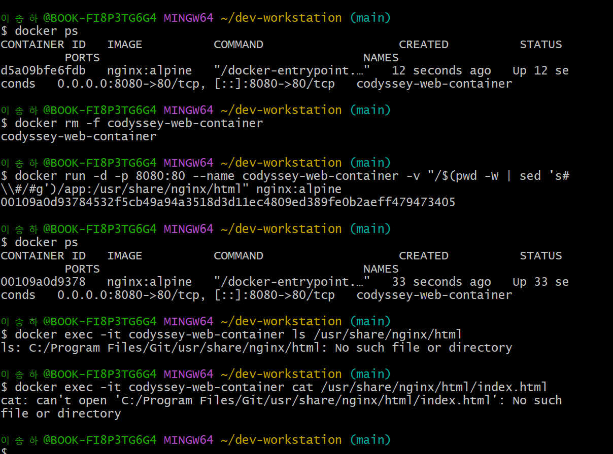

### 문제 상황
- Git Bash 환경에서 경로 변환 문제로 인해 `/usr/share/nginx/html` 접근 실패 발생

### 해결 결과
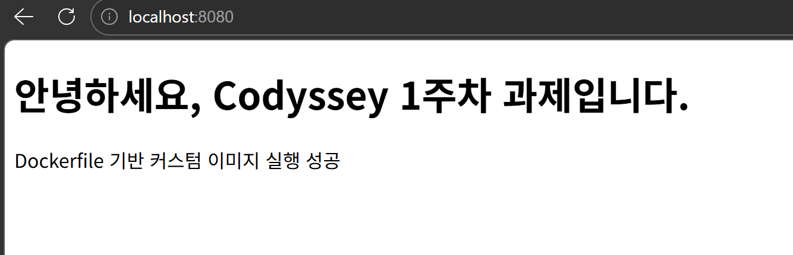

### 설명
- 로컬 `app` 폴더를 컨테이너에 연결
- 브라우저에서 수정한 HTML이 정상 출력됨을 확인

## 11. Docker 볼륨 영속성 검증

### 실행 명령
```bash
docker volume create mydata
docker run -d --name vol-test -v mydata:/data ubuntu sleep infinity
docker exec -it vol-test bash -lc "echo hi > /data/hello.txt && cat /data/hello.txt"
docker rm -f vol-test
docker run -d --name vol-test2 -v mydata:/data ubuntu sleep infinity
docker exec -it vol-test2 bash -lc "cat /data/hello.txt"
```

### 설명
- Docker 볼륨 `mydata`를 생성하였다.
- 첫 번째 컨테이너에서 `/data/hello.txt` 파일을 생성하고 데이터를 저장하였다.
- 컨테이너를 삭제한 뒤 동일한 볼륨을 연결한 새로운 컨테이너를 실행하였다.
- 삭제 이후에도 데이터가 유지되는 것을 확인하였다.

### 실행 결과

#### 1) 볼륨 생성
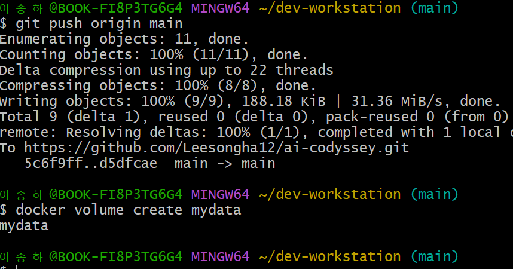

#### 2) 데이터 생성 및 확인
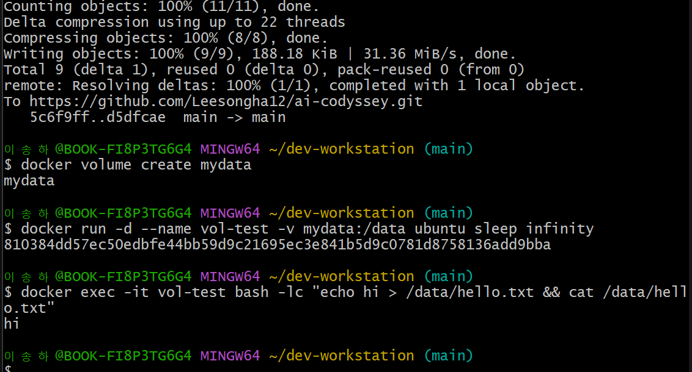

#### 3) 컨테이너 삭제 후 데이터 유지 확인
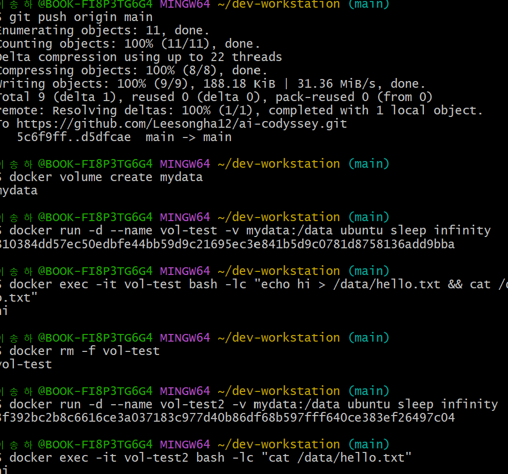 
* `exec`: 실행 중인 컨테이너에 새로운 프로세스를 실행
* 실습에서는 `exec` 방식이 더 안전하고 직관적이었다.
